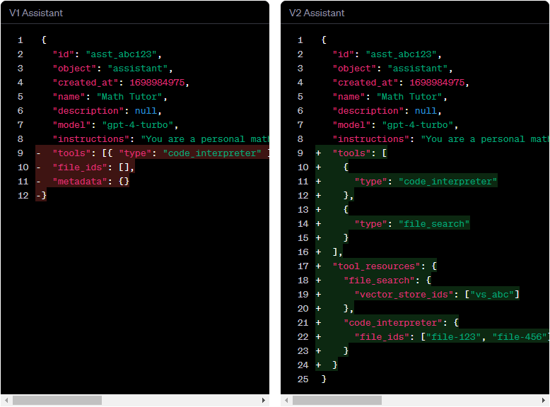
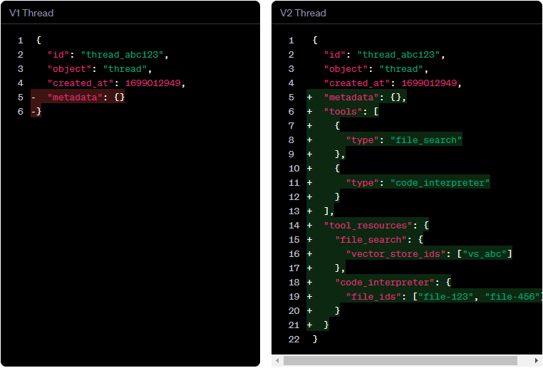
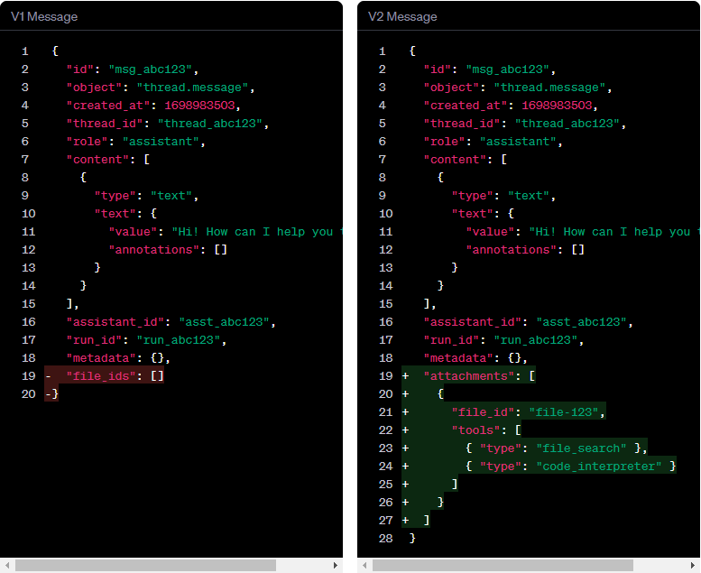

+++
title = '迁移指南 Beta'
date = 2024-05-06T15:21:51+08:00
draft = false
weight = 6
categories = ['AI', 'OpenAI', 'assistants']
tags = ['AI', 'OpenAI', 'assistants']
description = "我们已经改变了助手 API 在 beta 的 v1 版本和 v2 版本之间工具和文件的工作方式。今天，通过 API，两个 beta 版本仍然可以访问，但我们建议尽快迁移到我们 API 的最新版本。我们将在 2024 年底之前废弃 beta 的 v1 版本。"
keywords = ["助手 API", "迁移指南", "beta 版本", "v1 版本", "v2 版本", "工具", "文件", "迁移", "API 请求", "SDKs", "计费", "删除文件", "Playground"]
+++

我们已经改变了助手 API 在 beta 的 v1 版本和 v2 版本之间工具和文件的工作方式。今天，通过 API，两个 beta 版本仍然可以访问，但我们建议尽快迁移到我们 API 的最新版本。我们将在 2024 年底之前废弃 beta 的 v1 版本。

> 如果您今天不使用助手 API 的工具或文件，那么从 `v1` 版本迁移到 beta 的 `v2` 版本应该不需要进行任何更改。只需传递 `v2` beta 版本头文件和/或迁移到我们的 Node 和 Python SDK 的最新版本即可！

## 发生了什么变化
助手 API 的 v2 版本包含以下变化：

1. 工具重命名：检索工具已更名为文件搜索工具
2. 文件属于工具：文件现在与工具而不是助手和消息相关联。这意味着：
    - AssistantFile 和 MessageFile 对象不再存在。
    - 不再使用 AssistantFile 和 MessageFile，而是使用新的 tool_resources 对象将文件附加到助手和线程上。
        - 代码解释器工具的 tool_resources 是一个文件 ID 的列表。
        - 文件搜索工具的 tool_resources 是一个称为 vector_stores 的新对象。
    - 消息现在具有附件，而不是 file_ids 参数。消息附件是帮助程序，将文件添加到线程的 tool_resources 中。



助手现在具有工具和工具资源，而不是 file_ids。检索工具现在是文件搜索工具。文件搜索工具的工具资源是一个 vector_store。



线程可以将其自己的工具资源带入对话中。



消息具有附件，而不是文件ID。附件是将文件添加到线程的工具资源的助手。

您可以在 API 参考的“遗留”部分中找到助手 API 的所有 v1 端点和对象。

## 在 v2 中访问 v1 数据
为了使您在我们的 v1 和 v2 API 之间进行简单的迁移，我们会自动将 AssistantFiles 和 MessageFiles 映射到相应的 tool_resources，这取决于助手或运行中启用的工具。

|                                   | V1 VERSION                   | V2 VERSION                                                   |
|-----------------------------------|------------------------------|--------------------------------------------------------------|
| AssistantFiles for code_interpreter | file_ids on Assistant        | Files in an Assistant’s tool_resources.code_interpreter     |
| AssistantFiles for retrieval        | file_ids on Assistant        | Files in a vector_store attached to an Assistant (tool_resources.file_search) |
| MessageFiles for code_interpreter   | file_ids on Message          | Files in a Thread’s tool_resources.code_interpreter          |
| MessageFiles for retrieval          | file_ids on Message          | Files in a vector_store attached to a Thread (tool_resources.file_search) |

> 需要注意的是，虽然来自 v1 的 file_ids 被映射到 v2 的 tool_resources，但反之则不成立。您在 v2 中对 tool_resources 进行的更改不会在 v1 中反映为 file_ids。

因为助手文件和消息文件已经在 v2 中映射到了相应的 tool_resources，所以当您准备迁移到 v2 时，您不必担心数据迁移。相反，您只需要：

- 更新集成以反映新的 API 和对象。您可能需要做一些事情，比如：
  - 如果您使用的是检索工具，则迁移到创建向量存储并使用 file_search。重要的是，由于这些操作是异步的，您需要确保文件在创建运行之前已成功被向量存储摄取。
  - 如果您使用的是代码解释器工具，则迁移到将文件添加到 tool_resources.code_interpreter，而不是添加到助手或消息的文件中。
  - 如果您使用的是文件ID，则迁移到使用消息附件。
- 升级到我们 SDK 的最新版本。

## 更改 beta 版本
#### 没有 SDKs
您可以通过在 API 请求中传递正确的 API 版本头来访问两个 beta 版本：

1. v1: OpenAI-Beta: assistants=v1
2. v2: OpenAI-Beta: assistants=v2

```bash
curl "https://api.openai.com/v1/assistants" \
  -H "Content-Type: application/json" \
  -H "Authorization: Bearer $OPENAI_API_KEY" \
  -H "OpenAI-Beta: assistants=v2" \
  -d '{
    "instructions": "You are a personal math tutor. When asked a question, write and run Python code to answer the question.",
    "name": "Math Tutor",
    "tools": [{"type": "code_interpreter"}],
    "model": "gpt-4-turbo"
  }'
```

### 使用 SDKs
在发布 v2 beta 后发布的 SDKs 版本将默认将 openai.beta 命名空间指向 API 的 v2 版本。您仍然可以通过使用旧版本的 SDK（对于 python，使用 1.20.0 或更早版本，对于 node，使用 4.36.0 或更早版本）或者覆盖版本头来访问 API 的 v1 版本。

要安装旧版本的 SDK，您可以使用以下命令：

```python
pip install openai==1.20.0
```

您也可以在较新的 SDK 版本中覆盖此标头，但我们不建议此方法，因为这些新 SDK 版本中的对象类型将与 v1 对象不同。

```python
from openai import OpenAI

client = OpenAI(default_headers={"OpenAI-Beta": "assistants=v1"})
```

## 计费

在 v2 API 发布之前（2024年4月17日）创建的所有向量存储空间将在 2024 年底之前免费使用。这意味着在 v2 发布之前，由于我们将您的 v1 数据映射到 v2 而创建的任何向量存储空间都将免费。在 2024 年底之后，它们将按照当时的向量存储费用计费。请查看我们的定价页面获取最新的定价信息。

在 v2 API 发布之前（2024年4月17日）创建的任何向量存储空间，但在该发布日期和 2024 年底之间的某一日期之间未在单个运行中使用的将被删除。这是为了避免我们开始向您收费您在测试版期间创建但从未使用的内容。

在 v2 API 发布之后创建的向量存储空间将按照定价页面上指定的当前费率计费。

## 删除文件

通过 v1 API 删除助手文件 / 消息文件也会将它们从 v2 API 中删除。然而，反之则不成立 - 在 v2 版本的 API 中进行的删除不会传播到 v1。如果您在 v1 上创建了一个文件，并希望在 v1 和 v2 上的帐户中 "完全" 删除文件，您应该：

- 使用 v1 端点使用 v1 API 删除您使用 v1 API 创建的助手文件 / 消息文件，或者
- 删除底层文件对象 - 这样可以确保它在所有版本的 API 中的所有对象中完全删除。

## Playground
默认的 Playground 体验已迁移到使用 v2 版本的 API（您仍然可以查看 v1 版本对象的只读视图，但无法编辑它们）。通过 Playground 对工具和文件进行的任何更改只能在 v2 版本的 API 中访问。

为了在 v1 版本的 API 中对文件进行更改，您需要直接使用 API。

---

- [官网](https://platform.openai.com/docs/assistants/migration)
- 本文
    - [博客 - 从零开始学AI](https://openai-doc.aihub2022.top/docs/assistants/migration/)
    <!-- - [公众号 - 从零开始学AI](...) -->
    <!-- - [CSDN - 从零开始学AI](...) -->
    <!-- - [掘金 - 从零开始学AI](...) -->
    <!-- - [知乎 - 从零开始学AI](...) -->
    <!-- - [阿里云 - 从零开始学AI](...) -->
    <!-- - [腾讯云 - 从零开始学AI](...) -->
