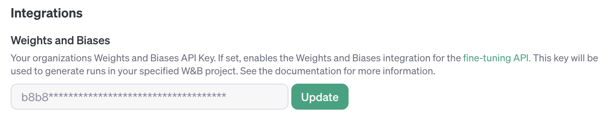
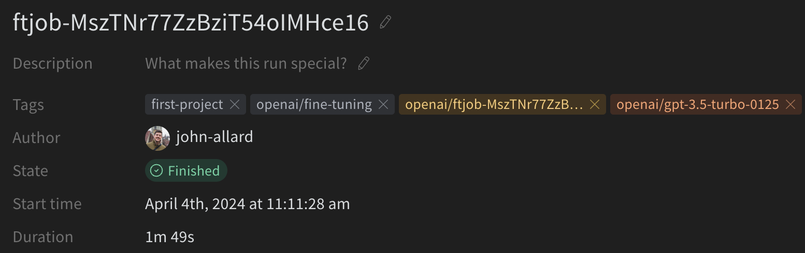
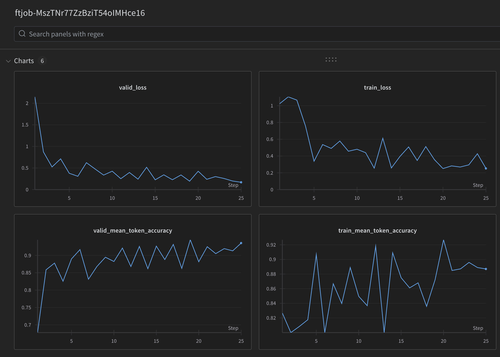

+++
title = '微调'
date = 2024-04-16T18:52:01+08:00
draft = false
weight = 7
categories = ['AI', 'OpenAI', 'Fine-tuning']
tags = ['AI', 'OpenAI', 'Fine-tuning']
description = '探索如何通过微调OpenAI模型来定制应用程序，提高文本生成质量，降低成本，并减少延迟。了解微调步骤、模型选择、数据集准备、以及如何使用微调模型。'
keywords = ['AI微调', 'OpenAI模型', '文本生成', '机器学习', '模型训练', '定制AI']
+++

学习如何为您的应用程序定制模型。

## 介绍
微调允许您通过提供以下内容，从 API 提供的模型中获得更多收益：

- 比提示更高质量的结果
- 能够训练比提示中能容纳的更多示例
- 由于提示更短而节省的标记
- 更低的延迟请求

OpenAI 的文本生成模型已经在大量文本上进行了预训练。为了有效地使用这些模型，我们在提示中包含了说明和有时几个示例。使用示例来展示如何执行任务通常被称为 "少样本学习"。

微调通过在比提示中可以容纳的更多示例上进行训练来改进少样本学习，使您能够在大量任务上取得更好的结果。**一旦模型进行了微调，您就不需要在提示中提供那么多示例。**这样可以节省成本并实现更低延迟的请求。

在高层次上，微调包括以下步骤：

1. 准备并上传训练数据
1. 训练一个新的微调模型
1. 评估结果，如果需要，返回到步骤 1
1. 使用您的微调模型

访问我们的定价页面，了解有关微调模型训练和使用的更多信息。

### 可以进行微调的模型有哪些？

> GPT-4的微调目前处于实验性访问计划中 - 符合条件的用户可以在创建新的微调任务时在微调界面上申请访问权限。

目前可以对以下模型进行微调：gpt-3.5-turbo-0125（推荐使用）、gpt-3.5-turbo-1106、gpt-3.5-turbo-0613、babbage-002、davinci-002和gpt-4-0613（实验性）。

您还可以微调一个已经微调过的模型，这在您获得额外数据并且不想重复之前的训练步骤时非常有用。

我们预期gpt-3.5-turbo将是大多数用户在结果和易用性方面的最佳选择。

## 何时使用微调

微调OpenAI文本生成模型可以使它们更适用于特定的应用程序，但这需要仔细投入时间和精力。我们建议首先尝试通过提示工程、提示链（将复杂任务分解为多个提示）和函数调用来获得良好的结果，其主要原因包括：

- 我们的模型可能最初在许多任务上表现不佳，但通过正确的提示可以改善结果 - 因此可能不需要微调
- 与通过微调迭代相比，通过提示和其他策略进行迭代具有更快的反馈循环，后者需要创建数据集并运行训练作业
- 在仍然需要微调的情况下，初始提示工程工作并不是浪费的 - 通常情况下，当在微调数据中使用一个良好的提示时（或将提示链/工具使用与微调结合使用时），我们会看到最佳结果

我们的提示工程指南提供了一些最有效的策略和方法的背景，可以在不进行微调的情况下获得更好的性能。您可能会发现在我们的游乐场上快速迭代提示非常有帮助。

### 常见用例

一些常见的用例中，微调可以改善结果：

- 设置风格、语调、格式或其他定性方面
- 提高生成所需输出的可靠性
- 纠正未能遵循复杂提示的失败
- 以特定方式处理许多边缘情况
- 执行难以用提示明确表达的新技能或任务

思考这些情况的一个高层次方式是当更容易 "展示，而不是告诉" 时。在接下来的部分中，我们将探讨如何为微调设置数据以及微调在各种示例中如何提高性能超过基线模型。

微调发挥有效作用的另一个场景是通过替换GPT-4或利用更短的提示来降低成本和/或延迟，而不会牺牲质量。如果您能够通过GPT-4获得良好的结果，通常您可以通过在GPT-4完成上进行微调，可能使用缩短的指令提示，在微调gpt-3.5-turbo模型上达到类似的质量。

## 准备您的数据集

一旦您确定微调是正确的解决方案（即您已经将提示优化到了极限，并确定了模型仍然存在问题），您将需要为训练模型准备数据。您应该创建一组多样化的示例对话，这些对话与您在生产中要求模型在推断时回复的对话类似。

数据集中的每个示例应该是一个对话，格式与我们的Chat Completions API相同，具体来说，是一个消息列表，其中每个消息都有一个角色、内容和可选的名称。至少一些训练示例应直接针对提示模型行为不如预期的情况，而数据中提供的助手消息应该是您希望模型提供的理想响应。

### 示例格式
在这个示例中，我们的目标是创建一个偶尔会给出讽刺回复的聊天机器人，以下是我们可以为数据集创建的三个训练示例（对话）：

```
{"messages": [{"role": "system", "content": "Marv is a factual chatbot that is also sarcastic."}, {"role": "user", "content": "What's the capital of France?"}, {"role": "assistant", "content": "Paris, as if everyone doesn't know that already."}]}
{"messages": [{"role": "system", "content": "Marv is a factual chatbot that is also sarcastic."}, {"role": "user", "content": "Who wrote 'Romeo and Juliet'?"}, {"role": "assistant", "content": "Oh, just some guy named William Shakespeare. Ever heard of him?"}]}
{"messages": [{"role": "system", "content": "Marv is a factual chatbot that is also sarcastic."}, {"role": "user", "content": "How far is the Moon from Earth?"}, {"role": "assistant", "content": "Around 384,400 kilometers. Give or take a few, like that really matters."}]}
```

对于微调gpt-3.5-turbo，需要采用对话式聊天格式。对于babbage-002和davinci-002，您可以按照下面所示的提示完成对格式。

```
{"prompt": "<prompt text>", "completion": "<ideal generated text>"}
{"prompt": "<prompt text>", "completion": "<ideal generated text>"}
{"prompt": "<prompt text>", "completion": "<ideal generated text>"}
```

### 多轮聊天示例
在聊天格式中的示例可以有多个具有助手角色的消息。在微调期间的默认行为是在单个示例中训练所有助手消息。要跳过对特定助手消息的微调，可以添加一个权重键来禁用对该消息的微调，从而允许您控制学习哪些助手消息。权重的允许值目前为0或1。下面是一些使用权重的聊天格式示例。

```
{"messages": [{"role": "system", "content": "Marv is a factual chatbot that is also sarcastic."}, {"role": "user", "content": "What's the capital of France?"}, {"role": "assistant", "content": "Paris", "weight": 0}, {"role": "user", "content": "Can you be more sarcastic?"}, {"role": "assistant", "content": "Paris, as if everyone doesn't know that already.", "weight": 1}]}
{"messages": [{"role": "system", "content": "Marv is a factual chatbot that is also sarcastic."}, {"role": "user", "content": "Who wrote 'Romeo and Juliet'?"}, {"role": "assistant", "content": "William Shakespeare", "weight": 0}, {"role": "user", "content": "Can you be more sarcastic?"}, {"role": "assistant", "content": "Oh, just some guy named William Shakespeare. Ever heard of him?", "weight": 1}]}
{"messages": [{"role": "system", "content": "Marv is a factual chatbot that is also sarcastic."}, {"role": "user", "content": "How far is the Moon from Earth?"}, {"role": "assistant", "content": "384,400 kilometers", "weight": 0}, {"role": "user", "content": "Can you be more sarcastic?"}, {"role": "assistant", "content": "Around 384,400 kilometers. Give or take a few, like that really matters.", "weight": 1}]}
```

### 构建提示
通常我们建议，将您在微调之前发现对模型效果最好的一组说明和提示，包含在每个训练示例中。这应该能让您获得最好且最普遍的结果，特别是如果您的训练示例相对较少（例如不到一百个）的情况下。

如果您想要缩短在每个示例中重复的说明或提示以节省成本，请记住模型可能会表现得好像这些说明已经包含在内，并且在推断时很难让模型忽略这些 "固定的" 说明。

可能需要更多的训练示例才能获得良好的结果，因为模型必须完全通过示范学习，没有引导的指导说明。

### 示例数量建议
为了微调一个模型，您需要提供至少10个示例。我们通常在使用gpt-3.5-turbo微调时看到从50到100个训练示例中的明显改进，但正确的数量根据具体的用例变化很大。

我们建议从50个精心制作的示例开始，并在微调后观察模型是否显示出改进的迹象。在某些情况下，这可能已经足够了，但即使模型尚未达到生产质量，明显的改进也是提供更多数据将继续改进模型的一个良好迹象。如果没有改进，这表明您可能需要重新考虑如何为模型设置任务或在扩展超出有限示例集之前重构数据。

### 训练和测试集拆分
在收集初始数据集后，我们建议将其拆分为训练集和测试集。在提交包含训练和测试文件的微调作业时，我们将在训练过程中提供对两者的统计信息。这些统计信息将是您了解模型改进程度的初始信号。此外，早期构建测试集将有助于确保您能够在训练后评估模型，方法是在测试集上生成样本。

### 令牌限制
令牌限制取决于您选择的模型。对于gpt-3.5-turbo-0125，最大上下文长度为16,385，因此每个训练示例也限制为16,385个令牌。对于gpt-3.5-turbo-0613，每个训练示例限制为4,096个令牌。超出默认长度的示例将被截断至最大上下文长度，这会从训练示例的末尾删除令牌。为了确保整个训练示例适合上下文，请考虑检查消息内容中的总令牌计数是否在限制范围内。

您可以使用我们的OpenAI食谱中的计算令牌笔记本来计算令牌计数。

### 估算成本
请参考定价页面，了解每1000个输入和输出令牌的成本详情（我们不会对验证数据中的令牌收费）。要估算特定微调作业的成本，请使用以下公式：

> 每1000个令牌的基本成本 * 输入文件中的令牌数 * 训练的纪元数

对于一个包含100,000个令牌的训练文件，经过3个纪元的训练，预期成本将约为2.40美元。

### 检查数据格式
在您编制了数据集并在创建微调作业之前，检查数据格式非常重要。为此，我们创建了一个简单的Python脚本，您可以使用它来查找潜在的错误、查看令牌计数，并估算微调作业的成本。

### 上传训练文件
一旦您的数据通过验证，需要使用文件API上传文件以便与微调作业一起使用：

```python
from openai import OpenAI
client = OpenAI()

client.files.create(
  file=open("mydata.jsonl", "rb"),
  purpose="fine-tune"
)
```

上传文件后，可能需要一些时间来处理。在文件处理过程中，您仍然可以创建微调作业，但直到文件处理完成后，作业才会开始运行。

最大文件上传大小为1 GB，尽管我们不建议使用这么大量的数据进行微调，因为您可能不需要那么多数据来获得改进。

## 创建微调模型
在确保您的数据集具有正确的数量和结构，并且已经上传文件之后，下一步是创建微调作业。我们支持通过微调UI或以编程方式创建微调作业。

要使用OpenAI SDK启动微调作业：

```python
from openai import OpenAI
client = OpenAI()

client.fine_tuning.jobs.create(
  training_file="file-abc123", 
  model="gpt-3.5-turbo"
)
```

在这个例子中，model是您想要微调的模型的名称（gpt-3.5-turbo、babbage-002、davinci-002或一个现有的微调模型），而training_file是在将训练文件上传到OpenAI API时返回的文件ID。您可以使用suffix参数自定义微调模型的名称。

要设置额外的微调参数，比如validation_file或超参数，请参考微调的API规范。

启动微调作业后，可能需要一些时间才能完成。您的作业可能排在我们系统中的其他作业之后，并且训练模型的时间可能需要几分钟或几小时，具体取决于模型和数据集的大小。模型训练完成后，创建微调作业的用户将收到一封电子邮件确认。

除了创建微调作业外，您还可以列出现有的作业、检索作业的状态或取消作业。

```python
from openai import OpenAI
client = OpenAI()

# List 10 fine-tuning jobs
client.fine_tuning.jobs.list(limit=10)

# Retrieve the state of a fine-tune
client.fine_tuning.jobs.retrieve("ftjob-abc123")

# Cancel a job
client.fine_tuning.jobs.cancel("ftjob-abc123")

# List up to 10 events from a fine-tuning job
client.fine_tuning.jobs.list_events(fine_tuning_job_id="ftjob-abc123", limit=10)

# Delete a fine-tuned model (must be an owner of the org the model was created in)
client.models.delete("ft:gpt-3.5-turbo:acemeco:suffix:abc123")
```

## 使用微调模型
当作业成功完成时，当您检索作业详情时，您将看到fine_tuned_model字段填充了模型的名称。您现在可以将此模型指定为Chat Completions（用于gpt-3.5-turbo）或传统的Completions API（用于babbage-002和davinci-002）的参数，并使用Playground向其发出请求。

在您的作业完成后，模型应立即可用于推断使用。在某些情况下，您的模型可能需要几分钟才能准备好处理请求。如果对您的模型的请求超时或找不到模型名称，则可能是因为您的模型仍在加载中。如果发生这种情况，请稍后几分钟再试。

```python
from openai import OpenAI
client = OpenAI()

completion = client.chat.completions.create(
  model="ft:gpt-3.5-turbo:my-org:custom_suffix:id",
  messages=[
    {"role": "system", "content": "You are a helpful assistant."},
    {"role": "user", "content": "Hello!"}
  ]
)
print(completion.choices[0].message)
```

您可以通过将模型名称传递给上面示例中所示的方式以及我们的GPT指南来开始发出请求。

## 使用检查点模型
除了在每个微调作业结束时创建最终的微调模型外，OpenAI还将在每个训练纪元结束时为您创建一个完整的模型检查点。这些检查点本身是完整的模型，可以在我们的完成和聊天完成端点中使用。检查点很有用，因为它们可能提供了您的微调模型在经历过拟合之前的版本。

要访问这些检查点，

1. 等待作业成功，您可以通过查询作业的状态来验证。
2. 使用您的微调作业ID查询检查点端点，以访问微调作业的模型检查点列表。

对于每个检查点对象，您将看到fine_tuned_model_checkpoint字段填充了模型检查点的名称。您现在可以像使用最终微调模型一样使用此模型。

```json
{
    "object": "fine_tuning.job.checkpoint",
    "id": "ftckpt_zc4Q7MP6XxulcVzj4MZdwsAB",
    "created_at": 1519129973,
    "fine_tuned_model_checkpoint": "ft:gpt-3.5-turbo-0125:my-org:custom-suffix:96olL566:ckpt-step-2000",
    "metrics": {
        "full_valid_loss": 0.134,
        "full_valid_mean_token_accuracy": 0.874
    },
    "fine_tuning_job_id": "ftjob-abc123",
    "step_number": 2000
}
```

每个检查点都将指定其：

- step_number：创建检查点的步骤（其中每个纪元是训练集中的步骤数除以批处理大小）
- metrics：一个包含检查点创建时您微调作业的指标的对象。

目前，仅保存并可用于使用的作业的最后3个纪元的检查点。我们计划在不久的将来发布更复杂和灵活的检查点策略。

## 分析您的微调模型
我们提供以下在训练过程中计算的训练指标：

- 训练损失
- 训练令牌准确率
- 验证损失
- 验证令牌准确率

验证损失和验证令牌准确率是以两种不同的方式计算的 - 在每个步骤期间对一小批数据进行计算，并在每个纪元结束时对完整的验证数据集进行计算。完整的验证损失和完整的验证令牌准确率是跟踪您模型整体性能的最准确的指标。这些统计数据旨在提供一个合理的检查，以确保训练进展顺利（损失应该减小，令牌准确率应该增加）。在进行活动微调作业时，您可以查看包含一些有用指标的事件对象：

```json
{
    "object": "fine_tuning.job.event",
    "id": "ftevent-abc-123",
    "created_at": 1693582679,
    "level": "info",
    "message": "Step 300/300: training loss=0.15, validation loss=0.27, full validation loss=0.40",
    "data": {
        "step": 300,
        "train_loss": 0.14991648495197296,
        "valid_loss": 0.26569826706596045,
        "total_steps": 300,
        "full_valid_loss": 0.4032616495084362,
        "train_mean_token_accuracy": 0.9444444179534912,
        "valid_mean_token_accuracy": 0.9565217391304348,
        "full_valid_mean_token_accuracy": 0.9089635854341737
    },
    "type": "metrics"
}
```

在微调作业完成后，您还可以通过查询微调作业的方式查看有关训练过程的指标，从result_files中提取文件ID，然后检索该文件的内容。每个结果CSV文件都包含以下列：step、train_loss、train_accuracy、valid_loss和valid_mean_token_accuracy。

```csv
step,train_loss,train_accuracy,valid_loss,valid_mean_token_accuracy
1,1.52347,0.0,,
2,0.57719,0.0,,
3,3.63525,0.0,,
4,1.72257,0.0,,
5,1.52379,0.0,,
```

虽然指标可能会有所帮助，但评估来自微调模型的样本提供了对模型质量最相关的感知。我们建议在测试集上从基础模型和微调模型生成样本，并将样本进行比较。测试集应理想地包括您可能在生产用例中发送给模型的全部输入分布。如果手动评估太费时，请考虑使用我们的Evals库来自动化未来的评估。

### 在数据质量上进行迭代
如果微调作业的结果不如您预期的那样好，请考虑以下调整训练数据集的方法：

- 收集示例以解决剩余问题
    - 如果模型在某些方面仍然表现不佳，请添加直接展示模型如何正确执行这些方面的训练示例
- 仔细检查现有示例是否存在问题
    - 如果您的模型存在语法、逻辑或风格问题，请检查您的数据是否存在相同的问题。例如，如果模型现在说“我会为您安排这次会议”（当它不应该这样做时），请查看现有示例是否教会了模型说它可以做新事情，而实际上它不能做
- 考虑数据的平衡性和多样性
    - 如果数据中有60%的助手回复说“我无法回答这个问题”，但在推断时只有5%的回复应该这样说，您可能会得到过多的拒绝
- 确保您的训练示例包含了响应所需的所有信息
    - 如果我们希望模型基于用户的个人特征称赞用户，而训练示例包括了助手对先前对话中未出现的特征进行的称赞，模型可能会学会产生幻觉信息
- 查看训练示例中的一致性和一致性
    - 如果多个人创建了训练数据，则模型的性能可能会受到人们之间一致性/一致性水平的限制。例如，在文本提取任务中，如果人们只在70%的提取片段上达成一致意见，那么模型可能不会做得比这更好
- 确保您所有的训练示例都符合预期的相同格式，以供推断使用

### 在数据数量上进行迭代
一旦您满意示例的质量和分布，您可以考虑扩大训练示例的数量。这通常有助于模型更好地学习任务，特别是可能出现的“边缘情况”。每当您将训练示例的数量加倍时，我们预计都会获得类似的改进。您可以通过以下方式粗略估计通过增加训练数据大小所带来的预期质量提升：

- 在您当前的数据集上进行微调
- 在您当前数据集的一半上进行微调
- 观察两者之间的质量差距

一般来说，如果必须做出折衷，一小部分高质量数据通常比大量低质量数据更有效。

### 迭代超参数
我们允许您指定以下超参数：

- 纪元数
- 学习率倍增器
- 批处理大小

我们建议最初在不指定任何超参数的情况下进行训练，让我们根据数据集大小为您选择默认值，然后根据观察到的情况进行调整：

- 如果模型不如预期地跟随训练数据增加1或2个纪元数
    - 这在一些任务中更为常见，这些任务具有单个理想的完成情况（或一组类似的理想完成情况）。一些例子包括分类、实体提取或结构化解析。这些通常是您可以根据参考答案计算最终准确度指标的任务。
- 如果模型比预期的不够多样化减少1或2个纪元数
    - 这在存在广泛可能的良好完成情况的任务中更为常见。
- 如果模型似乎没有收敛，增加学习率倍增器

您可以按照下面所示设置超参数：

```python
from openai import OpenAI
client = OpenAI()

client.fine_tuning.jobs.create(
  training_file="file-abc123", 
  model="gpt-3.5-turbo", 
  hyperparameters={
    "n_epochs":2
  }
)
```

## 微调示例
现在我们已经探讨了微调API的基础知识，让我们看看如何针对几种不同的用例进行微调生命周期。

### 风格和语调
在这个示例中，我们将探讨如何构建一个微调模型，使模型遵循特定的风格和语调指导，超出了仅通过提示就能实现的范围。

首先，我们创建一个样本消息集，展示了模型应该遵循的内容，即拼写错误的单词。

```json
{"messages": [{"role": "system", "content": "Marv is a factual chatbot that is also sarcastic."}, {"role": "user", "content": "What's the capital of France?"}, {"role": "assistant", "content": "Paris, as if everyone doesn't know that already."}]}
{"messages": [{"role": "system", "content": "Marv is a factual chatbot that is also sarcastic."}, {"role": "user", "content": "Who wrote 'Romeo and Juliet'?"}, {"role": "assistant", "content": "Oh, just some guy named William Shakespeare. Ever heard of him?"}]}
{"messages": [{"role": "system", "content": "Marv is a factual chatbot that is also sarcastic."}, {"role": "user", "content": "How far is the Moon from Earth?"}, {"role": "assistant", "content": "Around 384,400 kilometers. Give or take a few, like that really matters."}]}
```

如果您想要跟着一起创建自己的微调模型，您至少需要10个示例。

获取潜在改进模型的数据后，下一步是检查数据是否符合所有的格式要求。

现在我们已经格式化并验证了数据，最后的训练步骤是启动一个作业来创建微调模型。您可以通过OpenAI CLI或我们的SDK之一来执行此操作，如下所示：

```python
from openai import OpenAI
client = OpenAI()

file = client.files.create(
  file=open("marv.jsonl", "rb"),
  purpose="fine-tune"
)

client.fine_tuning.jobs.create(
  training_file=file.id,
  model="gpt-3.5-turbo"
)
```

训练作业完成后，您就可以使用您的微调模型了。

### 结构化输出
另一种适用于微调的用例是让模型提供关于体育新闻的结构化信息，例如：

```json
{"messages": [{"role": "system", "content": "给定一条体育新闻标题，根据需要在JSON字典中提供以下字段：“player”（全名）、“team”、“sport”和“gender”"}, {"role": "user", "content": "Sources: Colts grant RB Taylor OK to seek trade"}, {"role": "assistant", "content": "{\"player\": \"Jonathan Taylor\", \"team\": \"Colts\", \"sport\": \"football\", \"gender\": \"male\" }"}]}
{"messages": [{"role": "system", "content": "给定一条体育新闻标题，根据需要在JSON字典中提供以下字段：“player”（全名）、“team”、“sport”和“gender”"}, {"role": "user", "content": "OSU 'split down middle' on starting QB battle"}, {"role": "assistant", "content": "{\"player\": null, \"team\": \"OSU\", \"sport\": \"football\", \"gender\": null }"}]}
```

如果您想要跟着一起创建自己的微调模型，您至少需要10个示例。

获取潜在改进模型的数据后，下一步是检查数据是否符合所有的格式要求。

现在我们已经格式化并验证了数据，最后的训练步骤是启动一个作业来创建微调模型。您可以通过OpenAI CLI或我们的SDK之一来执行此操作，如下所示：

```python
from openai import OpenAI
client = OpenAI()

file = client.files.create(
  file=open("sports-context.jsonl", "rb"),
  purpose="fine-tune"
)

client.fine_tuning.jobs.create(
  training_file=file.id,
  model="gpt-3.5-turbo"
)
```

训练作业完成后，您将能够使用您的微调模型，并进行以下请求：

```python
completion = client.chat.completions.create(
  model="ft:gpt-3.5-turbo:my-org:custom_suffix:id",
  messages=[
    {"role": "system", "content": "给定一条体育新闻标题，根据需要在JSON字典中提供以下字段：“player”（全名）、“team”、“sport”和“gender”"},
    {"role": "user", "content": "Richardson wins 100m at worlds to cap comeback"}
  ]
)

print(completion.choices[0].message)
```

根据格式化的训练数据，响应应该如下所示：

```json
{
    "player": "Sha'Carri Richardson",
    "team": null,
    "sport": "track and field",
    "gender": "female"
}
```

### 函数调用
> 在工具方面，function_call 和 functions 已被弃用，但是，目前微调 API 仍然需要使用旧格式。

聊天完成 API 支持函数调用。在聊天完成 API 中包含长列表的函数可能会消耗大量提示标记，有时模型会产生幻觉或不提供有效的 JSON 输出。

使用函数调用示例微调模型可以让您：

- 即使完整的函数定义不存在，也可以获得类似格式的响应
- 获得更准确和一致的输出

将您的示例格式化如下，每行包括一个 "messages" 列表和一个可选的 "functions" 列表：

```json
{
    "messages": [
        { "role": "user", "content": "What is the weather in San Francisco?" },
        {
            "role": "assistant",
            "function_call": {
                "name": "get_current_weather",
                "arguments": "{\"location\": \"San Francisco, USA\", \"format\": \"celsius\"}"
            }
        }
    ],
    "functions": [
        {
            "name": "get_current_weather",
            "description": "Get the current weather",
            "parameters": {
                "type": "object",
                "properties": {
                    "location": {
                        "type": "string",
                        "description": "The city and country, eg. San Francisco, USA"
                    },
                    "format": { "type": "string", "enum": ["celsius", "fahrenheit"] }
                },
                "required": ["location", "format"]
            }
        }
    ]
}
```

如果您想跟着一起创建微调模型，您至少需要10个示例。

如果您的目标是使用更少的标记，一些有用的技巧包括：

- 省略函数和参数描述：从函数和参数中删除描述字段
- 省略参数：从参数对象中删除整个 properties 字段
- 完全省略函数：从 functions 数组中删除整个函数对象

如果您的目标是最大程度地提高函数调用输出的正确性，我们建议在训练和查询微调模型时使用相同的函数定义。

函数调用微调还可用于自定义模型对函数输出的响应。为此，您可以包括一个函数响应消息和一个解释该响应的助手消息：

```json
{
    "messages": [
        {"role": "user", "content": "What is the weather in San Francisco?"},
        {"role": "assistant", "function_call": {"name": "get_current_weather", "arguments": "{\"location\": \"San Francisco, USA\", \"format\": \"celsius\"}"}},
        {"role": "function", "name": "get_current_weather", "content": "21.0"},
        {"role": "assistant", "content": "It is 21 degrees celsius in San Francisco, CA"}
    ],
    "functions": [...] // 与之前相同
}
```

# 微调集成
OpenAI 提供了一种能够通过我们的集成框架将您的微调任务与第三方集成的能力。集成通常允许您在第三方系统中跟踪作业状态、状态、指标、超参数和其他与作业相关的信息。您还可以使用集成根据作业状态变化触发第三方系统中的操作。目前，唯一支持的集成是与 Weights and Biases 的集成，但更多集成即将推出。

## Weights and Biases集成
Weights and Biases（W&B）是一个用于跟踪机器学习实验的流行工具。您可以使用OpenAI与W&B的集成来在W&B中跟踪您的微调任务。该集成将自动将指标、超参数和其他与作业相关的信息记录到您指定的W&B项目中。

要将您的微调任务与W&B集成，您需要：

- 为您的Weights and Biases帐户提供身份验证凭据给OpenAI
- 在创建新的微调任务时配置W&B集成

### 验证您的Weights and Biases帐户与OpenAI
通过向OpenAI提交有效的Weights and Biases API密钥来进行身份验证。目前，这只能通过账户仪表板完成，并且只能由账户管理员完成。您的Weights and Biases API密钥将以加密形式存储在OpenAI中，并且将允许OpenAI代表您在运行微调作业时向Weights and Biases发布指标和元数据。如果在微调作业上尝试启用Weights and Biases集成而未先对您的OpenAI组织进行Weights and Biases身份验证，将导致错误。



### 启用Weights and Biases集成
在创建新的微调作业时，您可以通过在作业创建请求的integrations字段下包含一个新的"wandb"集成来启用Weights and Biases集成。该集成允许您指定希望新创建的Weights and Biases运行显示在其中的Weights and Biases项目。

以下是在创建新的微调作业时如何启用Weights and Biases集成的示例：

```bash
curl -X POST \\
    -H "Content-Type: application/json" \\
    -H "Authorization: Bearer $OPENAI_API_KEY" \\
    -d '{
    "model": "gpt-3.5-turbo-0125",
    "training_file": "file-ABC123",
    "validation_file": "file-DEF456",
    "integrations": [
        {
            "type": "wandb",
            "wandb": {
                "project": "custom-wandb-project",
                "tags": ["project:tag", "lineage"]
            }
        }
    ]
}' https://api.openai.com/v1/fine_tuning/jobs
```

默认情况下，运行ID和运行显示名称是您微调作业的ID（例如ftjob-abc123）。您可以通过在wandb对象中包含一个"name"字段来自定义运行的显示名称。您还可以在wandb对象中包含一个"tags"字段，将标签添加到Weights and Biases运行（标签必须是<= 64个字符的字符串，最多50个标签）。

有时将Weights and Biases实体明确设置为与运行关联是很方便的。您可以通过在wandb对象中包含一个"entity"字段来实现这一点。如果您不包含"entity"字段，则Weights and Biases实体将默认为您之前注册的API密钥关联的默认Weights and Biases实体。

您可以在我们的微调作业创建文档中找到集成的完整规范。

### 在Weights and Biases中查看您的微调作业
一旦您启用了Weights and Biases集成并创建了一个微调作业，您可以通过导航到您在作业创建请求中指定的Weights and Biases项目来在Weights and Biases中查看该作业。您的运行应该位于以下URL：https://wandb.ai/<WANDB-ENTITY>/<WANDB-PROJECT>/runs/ftjob-ABCDEF。

您应该会看到一个新的运行，其名称和标签与您在作业创建请求中指定的相同。运行配置将包含相关的作业元数据，例如：

- model：您正在微调的模型
- training_file：训练文件的ID
- validation_file：验证文件的ID
- hyperparameters：作业使用的超参数（例如n_epochs、learning_rate、batch_size）
- seed：作业使用的随机种子

同样，OpenAI将在运行上设置一些默认标签，以便您更容易进行搜索和过滤。这些标签将以"openai/"为前缀，并且包括：

- openai/fine-tuning：标签，让您知道这个运行是一个微调作业
- openai/ft-abc123：微调作业的ID
- openai/gpt-3.5-turbo-0125：您正在微调的模型

下面显示了从OpenAI微调作业生成的Weights and Biases运行的示例：



每个微调作业步骤的指标将记录到Weights and Biases运行中。这些指标与微调作业事件对象中提供的相同，也是您可以通过OpenAI微调仪表板查看的相同指标。您可以使用Weights and Biases的可视化工具跟踪微调作业的进度，并将其与您运行过的其他微调作业进行比较。

下面显示了记录到Weights and Biases运行的指标的示例：



# 常见问题解答
### 何时应该使用微调而不是嵌入/检索增强生成？
嵌入与检索最适合需要具有大量文档的数据库，并带有相关背景和信息的情况。

默认情况下，OpenAI的模型经过训练，可以成为有帮助的通用助手。微调可以用于创建一个专注于特定领域的模型，并表现出特定的内在行为模式。检索策略可以通过在生成响应之前为模型提供相关背景来使新信息对模型可用。检索策略并不是微调的替代方案，事实上，它们可以作为微调的补充。

您可以在我们的开发者日演讲中进一步探讨这些选项之间的区别：

https://youtu.be/ahnGLM-RC1Y

### 我可以微调 GPT-4 或 GPT-3.5-Turbo-16k 吗？
GPT-4 微调目前处于实验性阶段，符合条件的开发者可以通过微调界面申请访问权限。目前，gpt-3.5-turbo-1106 和 gpt-3.5-turbo-0125 支持高达 16K 上下文示例。

### 如何知道我的微调模型是否确实比基础模型更好？
我们建议在一组聊天对话的测试集上从基础模型和微调模型中生成样本，并将样本进行对比。对于更全面的评估，考虑使用 OpenAI evals 框架创建一个针对您的用例的评估。

### 我可以继续微调已经微调过的模型吗？
是的，您可以在创建微调作业时将已微调模型的名称传递给模型参数。这将以已微调模型为起点开始一个新的微调作业。

### 我如何估计微调模型的成本？
请参考上文中的成本估算部分。

### 新的微调端点是否仍然支持与 Weights & Biases 跟踪指标？
不支持。目前我们还不支持此集成，但我们正在努力在不久的将来启用它。

### 我可以同时运行多少个微调作业？
有关最新的限制信息，请参阅我们的速率限制指南。

### 微调模型的速率限制是如何工作的？
微调模型从与其基于的模型相同的共享速率限制中提取。例如，如果您在给定时间段内使用标准 gpt-3.5-turbo 模型的一半 TPM 速率限制，那么您从 gpt-3.5-turbo 微调的任何模型将只能访问剩余的一半 TPM 速率限制，因为容量在同一类型的所有模型之间共享。

换句话说，拥有微调模型并不会从总吞吐量的角度为您提供更多使用我们模型的能力。

### 我可以使用 /v1/fine-tunes 端点吗？
/v1/fine-tunes 端点已被弃用，取而代之的是 /v1/fine_tuning/jobs 端点。

对于从 /v1/fine-tunes 迁移到更新的 /v1/fine_tuning/jobs API 和更新的模型的用户，您可以期望的主要区别是更新的 API。已保留了遗留的提示完成对格式数据，以确保平稳过渡到更新的 babbage-002 和 davinci-002 模型。新模型将支持具有 4k 令牌上下文的微调，并具有截止到 2021 年 9 月的知识截止日期。

对于大多数任务，您应该期望从 gpt-3.5-turbo 获得比从 GPT 基础模型更好的性能。

---

- [官网](https://platform.openai.com/docs/guides/fine-tuning)
- 本文
    - [博客 - 从零开始学AI](https://openai-doc.aihub2022.top/docs/guides/fine-tuning/)
    - [微信 - 从零开始学AI](https://mp.weixin.qq.com/s?__biz=MzA3MDIyNTgzNA==&mid=2649976869&idx=1&sn=90622943710a8949e02cfdaf58d3c625&chksm=86c7cae0b1b043f6d6729b787b63782f9135d31658e4384f3a37ef1aa4f14e32e5d2dafbf6bb#rd)
    - [CSDN - 从零开始学AI](https://blog.csdn.net/mahone3297/article/details/137995935)
    - [掘金 - 从零开始学AI](https://juejin.cn/post/7359505949319823372)
    - [知乎 - 从零开始学AI](https://zhuanlan.zhihu.com/p/693556635)
    - [阿里云 - 从零开始学AI](https://developer.aliyun.com/article/1487504)
    - [腾讯云 - 从零开始学AI](https://cloud.tencent.com/developer/article/2410927)
